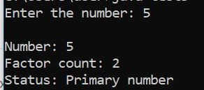
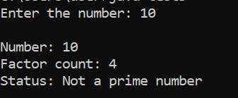

### Write a programe to determine if a given number is a prime number or not.

 - Hint: A prime number is a integer greater than 1 that has no divisor other that 1 and it self.

  Step to solve:

 1.Input the Number : prompt the user to enter a positive integer.

 2.check for prime:

 - start by dividing the number by integers starting from 1 up to the number itself.

 - counting how many integers divide the number evenly (without leaving a remainder).

 3. Determine the Result:

 - If the number has exactly two divisors(1 and itself), it is a prime number.

 - If it has more than two divisor, it is not a prime number

### Expected output :

 

 

