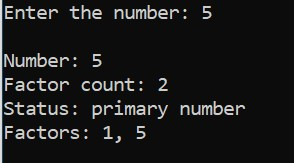
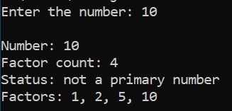

# Add a new feature to display factors.

#### Add a new feature to the program that displays the factors of a number.This feature should dynamically find all factors and display them.

- Hint: use Array to store factors and print them out.

### Steps:
 
 #### 1.Input Validation

 - Prompt user to enter a number.

 - if the user enters a nagative number, display "Enter the non-negative number" and exit the program gracefully.

 #### 2. Factor identification:
 - identify all factors of the uumber using loop.

 - store these factors in an array for late use.

 #### 3. Fcator count:

 - count and display the total number of factors.

 #### 4. Expected output formatting:

 - print the input number.

 - print the factor count.

 - print the primary number status.

 - Display all factors ina single line ,separated by commas,for readability.

 ### Expected output:

 

 

