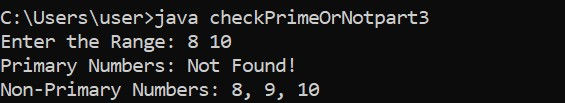

# Prime Number Checker with Range Classification.

## Write a Java program that performs the following:

#### 1. Takes a range of integers as input from the user (start and end).
#### 2. Checks each number in the range to determine if it is a prime number.
#### 3. Stores all prime numbers in a list called primaryNumbers and all non-prime numbers in another list called nonPrimaryNumbers.
#### 4. Displays the lists in a formatted, comma-separated form. If no numbers exist in a list, display "Not Found!".

## Constraints:

- Only numbers greater than 1 should be checked.
- Use a helper method isPrime() to determine if a number is prime.
- Use another helper method formatList() to format the lists for output.

## Expected Output.

---

---

---

