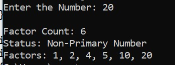
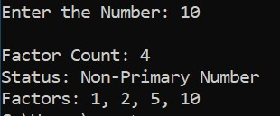
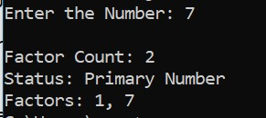
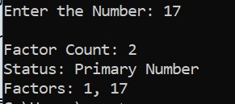
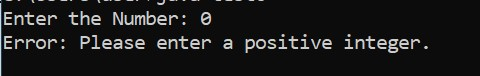

## Program for Factor Calculation and Prime Number Verfication.

### 1. Functionality :

- The program should calculate all factors of a given positive number.

- It should determine if the numbers is a prime number.(has exactly two factors).

### 2. Methods:

 `` getFactors(int number)``

- This method calculates all factors of a given number and stores them in an array.

`` isPrime(int[] factors)``

- This method checks if the input number is a prime number by analyzing the length of factors array.

### 3. Input Validation :

- Accepts a single positive integer from the user via the console.

- Non-negative or non -numeric values must he handled gracefully with an error message.

## Expected outpts :

---

---

---

---

